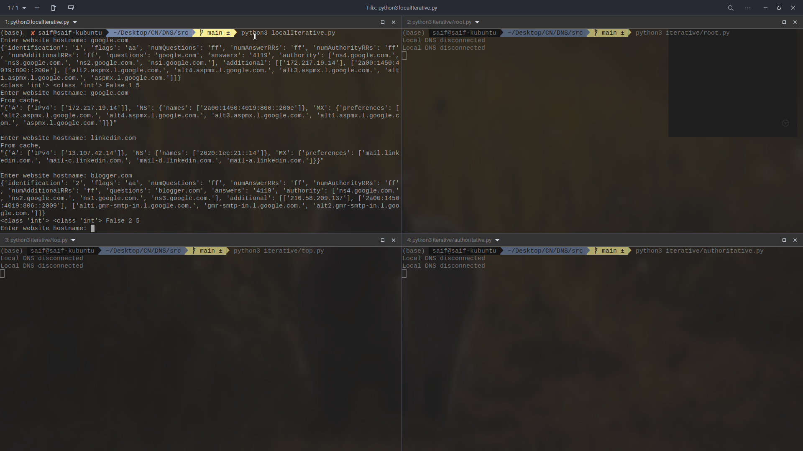
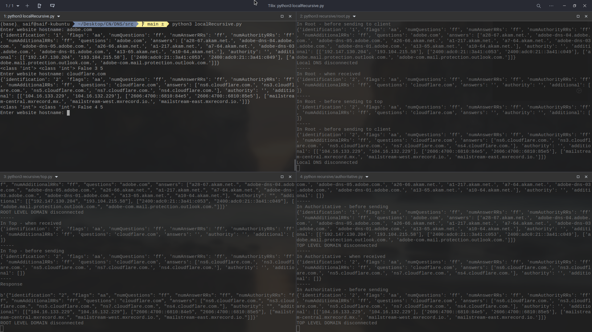

# NeoDomain

A local DNS server implementation of the Iterative and the Recursive models using Python.

## Iterative Model

To start the iterative model,

1. Open a terminal tab, and `cd` into `src`
2. Run `python3 iterative.py` to start the local iterative server
3. For the `root`, `top`, and `authoritative` servers, open a termainal tab for each, and start each of them using `python3`.
4. Enter the hostname to fetch data for in the terminal tab for `iterative.py`
5. See results

## Recursive Model

1. Open a terminal tab, and `cd` into `src`
2. Run `python3 recursive.py` to start the local recursive server
3. For the `root`, `top`, and `authoritative` servers, open a termainal tab for each, and start each of them using `python3`.
4. Enter the hostname to fetch data for in the terminal tab for `recursive.py`
5. See results

